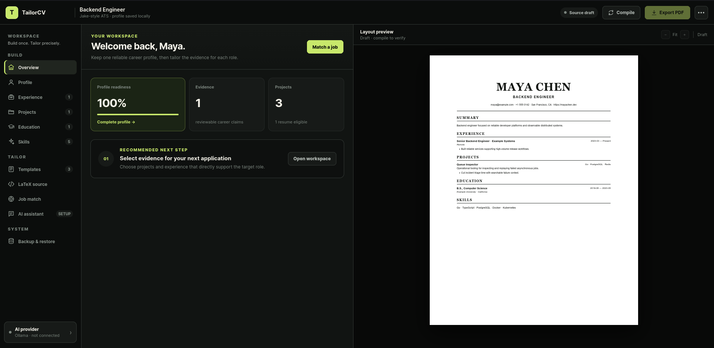
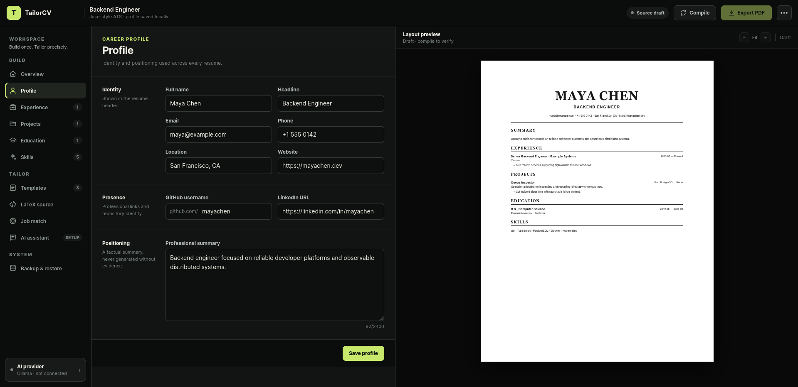
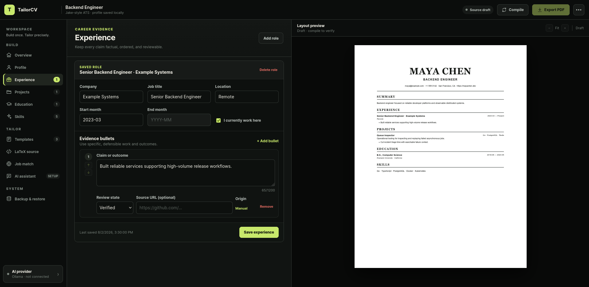
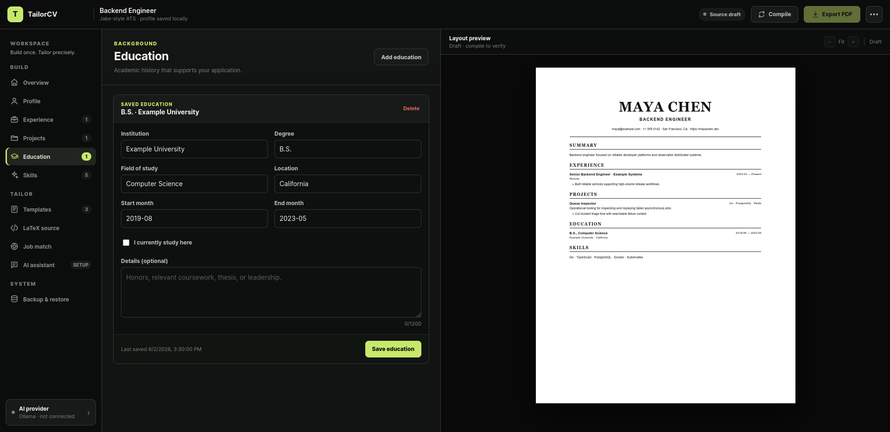
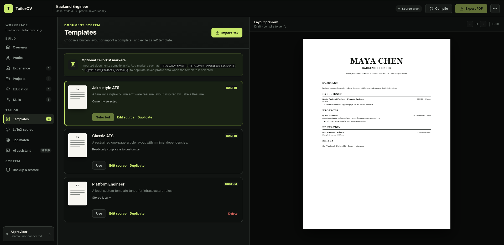

# TailorCV

TailorCV is a local-first desktop resume builder that turns a reusable career profile into an evidence-backed, job-specific LaTeX resume and PDF.

The application is built with Wails, Go, React, TypeScript, SQLite, and Tectonic. Cloud AI is optional: TailorCV supports local generation through Ollama, cloud generation through Gemini, and a deterministic no-AI workflow.

## Current status

TailorCV has a complete deterministic resume-building vertical slice, local compilation, and evidence-constrained Ollama and Gemini tailoring workflows. It currently provides:

- A Wails desktop shell with a React interface.
- A locally persisted career profile backed by SQLite.
- Manual experience records with ordered, provenance-aware evidence bullets.
- Reviewable projects with skills, source links, eligibility, and ordered evidence.
- Education records with validated study dates and live resume-preview rendering.
- Evidence-backed certifications and achievements plus ordered professional contact links.
- Persisted job opportunities with alias-aware skill matching and explainable evidence ranking, including user-set priority and role/project recency.
- Structured required/preferred skill and responsibility extraction backed by a synchronized SQLite FTS5 evidence index.
- Manual evidence selection with saved applications, `draft`/`submitted`/`archived` lifecycle controls, and immutable numbered LaTeX resume snapshots, including evidence-ranking explanations and content hashes.
- New immutable versions for edited source, with compilation metadata and private per-version PDF artifacts.
- A dark split workspace with project selection, a CodeMirror LaTeX editor, clickable compiler diagnostics, and a zoomable PDF.js preview.
- Read-only Jake-style and Classic ATS templates, plus persistent user-imported `.tex` templates.
- Debounced local Tectonic compilation with structured line diagnostics, isolated untrusted workspaces, resource limits, and native `.tex`/`.pdf` export.
- Versioned JSON backup and atomic restore for all currently supported profile data.
- Public GitHub repository sync with stable repository identity, visibility, update timestamps, bounded README snapshots, complete language detection, user-controlled language selection, and an explicit review gate before resume eligibility.
- Clear service boundaries for GitHub import, resume generation, templates, and PDF compilation.
- A provider-neutral AI contract with versioned structured output, strict fact/citation, metric, technology, and traceability validation.
- Ollama health and model discovery, bounded generation, cancellation, recorded contract tests, and side-by-side proposal review before immutable version creation.
- Gemini model discovery and JSON-constrained generation behind the same contract, validator, cancellation, response limits, and review gate.
- Native operating-system keyring storage for the Gemini API key, with write-only credential UI and separately persisted non-secret provider preferences.
- Auditable AI-run history without secrets or raw prompts; failed provider and validation runs are recorded safely.
- End-to-end service tests for deterministic and recorded-Ollama resume workflows, plus React integration tests that exercise the corresponding Wails binding calls.
- Native Linux, macOS, and Windows CI that runs Go tests and migrations, frontend tests and type-checking, packaged Wails builds, real offline Tectonic integration checks, disposable application workflows, and native credential-store lifecycle checks.

See [PLAN.md](PLAN.md) for the product architecture and delivery milestones.

## Screenshots

### Workspace overview



| Profile editor | Experience editor |
| --- | --- |
|  |  |

| Education editor | Resume templates |
| --- | --- |
|  |  |

## Principles

- **Local first:** Career data stays on the user's computer by default.
- **Evidence backed:** Generated claims must reference stored facts.
- **Provider optional:** Core resume building must work without a cloud AI provider.
- **Editable output:** Users retain the LaTeX source and compiled PDF.
- **Safe compilation:** Models produce structured content, not executable LaTeX.

## Prerequisites

- Go 1.25 or newer
- Node.js 20 or newer
- pnpm
- Wails v2 CLI
- For development compilation, Tectonic plus a local `tectonic-resources.zip` beside it, or paths configured through `TAILORCV_TECTONIC` and `TAILORCV_TECTONIC_BUNDLE`
- Linux development packages required by Wails, or the corresponding Windows/macOS toolchain

Install the Wails CLI:

```bash
go install github.com/wailsapp/wails/v2/cmd/wails@v2.12.0
```

## Development

Install frontend dependencies:

```bash
cd frontend
pnpm install
```

Run the desktop application with live reload:

```bash
wails dev
```

To run the embedded production frontend directly on Linux with WebKitGTK 4.1:

```bash
pnpm --dir frontend build
go run -tags "production,webkit2_41" .
```

Run the checks used during development:

```bash
go test ./...
pnpm --dir frontend test
pnpm --dir frontend build
```

Live AI contract checks are opt-in and always use fictional evidence. Set `TAILORCV_AI_LIVE_PROVIDER` to `ollama` or `gemini`, set `TAILORCV_AI_LIVE_MODEL`, and run:

```bash
go test -count=1 -run TestLiveProviderContract -v ./internal/ai
```

Ollama uses `TAILORCV_OLLAMA_ENDPOINT` when set, otherwise the local default. Gemini additionally requires `TAILORCV_GEMINI_API_KEY` to be supplied by the current shell or secure CI secret store. The harness does not persist credentials or print raw provider responses.

Build the desktop application:

```bash
wails build
```

To assemble the current platform's pinned Tectonic 0.16.9 executable and curated offline TeX Live 2022.0r0 resources beside a packaged application, run:

```bash
go run ./cmd/packagetectonic -destination build/bin/bin
```

On macOS, use `build/bin/TailorCV.app/Contents/MacOS/bin` as the destination. The packager verifies the official executable archive checksum, hydrates the built-in-template resources, and compiles both offline fixtures before succeeding. Packaging needs network access; ordinary application compilation does not.

On Linux distributions that provide WebKitGTK 4.1 rather than 4.0, use:

```bash
wails build -tags webkit2_41
```

## Continuous integration

GitHub Actions runs the Go test and vet suites, frontend tests and production build, and a native Wails package build on Linux amd64, macOS arm64, and Windows amd64. Storage migration coverage is part of the Go suite.

Successful runs retain each platform build for seven days. These unsigned artifacts include the checksum-verified Tectonic 0.16.9 executable and a pinned, curated TeX Live 2022.0r0 resource bundle for the built-in templates. Each native job compiles both built-in templates from the packaged resources with network access disabled at the Tectonic layer before uploading its artifact.

Before upload, CI also runs the packaged application binary in two verification modes. The workflow check uses a disposable database and scripted dialog destinations to exercise profile persistence, GitHub review, immutable edit/compile/reopen/export, and backup/restore with the bundled compiler. The credential check writes a randomly generated disposable secret to Windows Credential Manager, macOS Keychain, or Linux Secret Service, verifies it, deletes it, and confirms deletion without printing the secret. Interactive native-dialog and first-run UI checks remain a manual release gate documented in [RELEASE_CHECKLIST.md](RELEASE_CHECKLIST.md).

## Local data

The desktop application stores its SQLite database below the current operating system's user configuration directory in a `tailorcv` folder. Development and test databases, generated resumes, credentials, and user PDFs must not be committed.

Use **Backup & restore** in the application sidebar to export a portable JSON snapshot. Backup format v6 includes evidence ranking priorities, professional links, certifications, achievements, public GitHub repository metadata, custom templates, selected-template state, applications, resume source history, auditable AI-run metadata, and non-secret AI preferences. Versions 1 through 5 remain importable. Imports are fully validated before replacing local data in one transaction. Provider credentials, generated PDFs, compiler caches, and local model data are intentionally excluded.

Custom templates are stored locally in the same SQLite database. Use **Templates → Import .tex** for complete, single-file LaTeX documents. Imported files compile as-is; TailorCV data markers are optional and documented in the Templates screen. Built-in templates are read-only, and editing one creates a user-owned copy.

Compiled resume-version PDFs are derived artifacts stored privately in the local `tailorcv/artifacts` application-data folder. JSON backups preserve source, evidence, hashes, and compilation diagnostics, but intentionally exclude generated PDF files and machine-specific artifact paths.

For packaged builds, TailorCV resolves Tectonic in this order: `TAILORCV_TECTONIC`, a `bin/tectonic` executable beside the app, an executable beside the app, then the system `PATH`. It then requires `TAILORCV_TECTONIC_BUNDLE` or `tectonic-resources.zip` beside that executable. Every compilation uses the local bundle with `--only-cached` and `--untrusted`; a custom template that needs resources outside the curated built-in set fails with a diagnostic instead of downloading them.

## Repository layout

```text
frontend/          React and TypeScript interface
internal/domain/   Core profile and matching rules
internal/storage/  SQLite persistence and migrations
app.go             Wails-facing application service
main.go            Desktop entry point
PLAN.md            Product and implementation roadmap
```

## Security

Do not report sensitive personal resume data in a public issue. TailorCV does not store provider tokens in SQLite, backups, AI-run records, or frontend state after saving; Gemini credentials are kept in the operating-system credential store.

AI tailoring sends only normalized job requirements and facts explicitly selected by the user. Proposed wording is rejected when it cites unknown facts, introduces unsupported metrics or recognized technologies, or cannot be traced to meaningful terms in its cited evidence. Generated wording is never written back as verified profile evidence.

## License

No license has been selected yet. Until one is added, the source remains publicly viewable but is not granted an open-source license.
